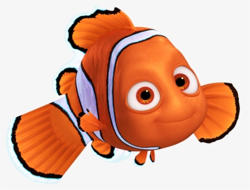

# Waiting For GAdot

The goal of this project was to create my own genetic algorithm, and implement it on the problem of recreating images as pointillist paintings. (Paintings using only circles and dots)

## Methods

### Selection Function
The selection function used to the most success was tournament selection. In this function, a random sample of organisms in the population are placed in a 'habitat'. At this point the most fit organisms in the habitat will breed, and the weakest will die. This selection function is rank based, as opposed to quantitavely fitness based.

### Breeding Function
The breeding function used throughout this project is one of uniform crossover. One where each gene may be taken from either parent. Although it is not even chance, but instead weighted by fitness dominance. The offspring is then mutated according to the mutation function.

### Mutation Function
Optimizing the mutation function probabilities and process proved to be the most important piece of creating coherent images. The mutation function used to the highest degree of success is one that did three things...
* Had a small chance to mutate a single property (color, size, position) of each gene/dot. The mutation size was decided by a gaussian centered on 15% with a 4% standard deviation. A random value would then be mutated to between (1-mutationSize)*previousValue and (1+mutationSize)*previousValue
* A chance at adding a new dot with random properties
* A chance at removing a random dot. These mutations proved essential, as instead of the genepool being of constant size, and potentially overwhelming to the algorithm; the algorithm could instead optimize genes at a pace it could control and manage

### Fitness Function
The fitness is calculated by summing the 'distance' between the refrence image, and the created image in LAB colorspace, for each pixel. For distance calculations the color coordinates are treated as spacial coordinates. LAB units are used as opposed to RGB because they are approximately perceptually uniform. 

Note: this fitness function has negative values, with an ideal fitness of 0. This is not an issue for rank based selection such as the one reccomended for this project But if you want to use a fitness based selection, you will likely have to adjust by something such as... Taking 1 - (the ratio of the observed 'distance' to the maximum possible distance.)

## Results
Because this is a recent project, there is still more testing to be done, I will update this with results.
### Pop Images/Icons
A good degree of success has been found using small graphics with my trial on small images with white background.

Here is the image I did my tests with...

And here are the results found so far, for **400 Generations**, **1000 Generations**, and **3500 Generations**, respectively...

The fitness was continuing to improve each generation still at this point, and could likely benefit from several thousand more generations. I would like to come back to this particular population again in the future and will update this page accordingly.

### Full Background Images
The goal is for Waiting For GAdot to be able to handle fullscale images as well as pop-art. This is still in early testing on the following image.

Results will (hopefully) be posted here in the near future

## Run Waiting For GAdot yourself!

This can be done very easily! Find an image you would like to recreate (Nemo was of size 420x370 pixels) and add that into a project folder. See the Nemo project folder for an example. Then, go to the startProject.py file and simply follow the instructions! Your population will periodically get saved in a pickle inside your project folder. To resume a run at a later time, go to loadPop.py and point towards this pickle file.
